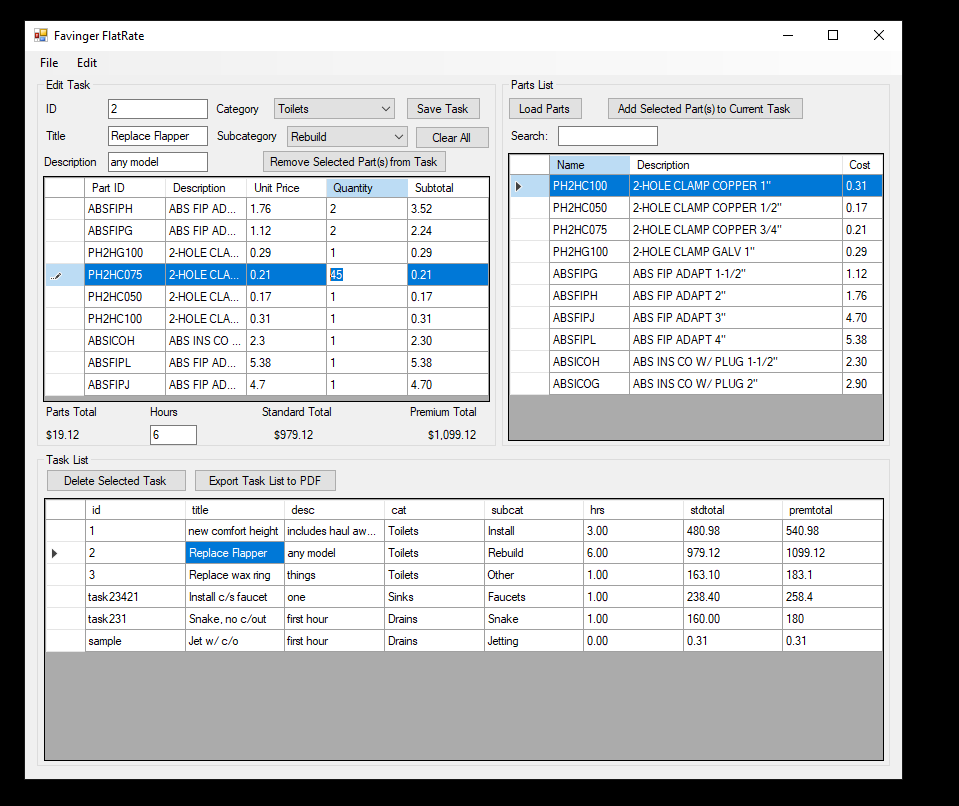
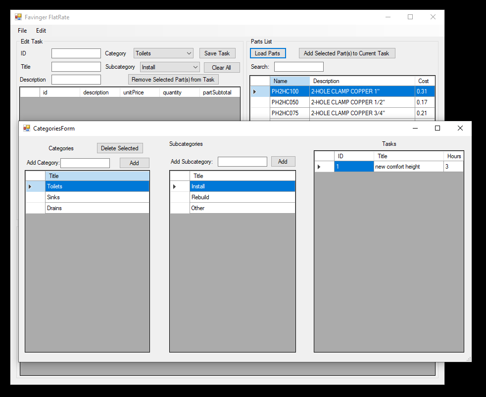

# FlatRate

Favinger Plumbing operates on a "flat rate" system, where each task the plumber completes is assigned a flat price. While this price is based on assumed labor and parts, the labor and parts for a particular instance of a task may vary somewhat. This pricing system saves a great deal of time (no need to count every small part of every task completed each time) and allows up-front pricing (the price doesn't change just because the job took slightly longer or shorter). The system does not lose substantial flexibility, since auxiliary tasks can be used to account for special circumstances and other unforseen complications. 

A key tool for this system is a flat rate book, containing an organized list of tasks and their prices at different rates. With our old book going out of date and no good tools to create a new one, a complicated system of spreadsheets and mail-merging was proposed. I suggested and created the FlatRate program as a simpler and more effective system to allow the creation of tasks from our established parts list (spreadsheet) and the exporting of those tasks to a printable book.

Favinger FlatRate is written in C# using the .NET framework. The core of the program uses DataSet and related classes in the ADO.NET architecture to keep track of application data in a relational database structure. A variety of types of relationship are captured in the schema including a many-to-many table representing parts and quantities in each task, and various primary/foreign key interactions. As expected in such a data structure, deleting a category also removes associated 'subcategories,' 'tasks,' and 'tasks_parts' rows. Calculated values such as total costs are not stored in the data tables to better normalize the data, and are instead calculated as needed in the application logic.

FlatRate makes extensive use of the DataGridView class and data binding to represent the application data to the user. The user can simultaneously view part and task lists while editing a task. FlatRate provides CRUD functionality for tasks and categories, but parts are only uploaded and referenced. This was an intentional design decision, since the program was intended to simplify record-keeping of parts in relation to a flat rate book. Our part information is stored in a spreadsheet in a particular structure to interface with our inventory software. This spreadsheet acts as the central source of, and authority on, part information, so FlatRate was written to work in that system.

The program uses MigraDoc (MIT-licensed open source pdf creation library) to help create an organized pdf document which allows sections to be reprinted when tasks or prices change. Besides storing application data for future use, this is the primary output of the program.

There were a few weaknesses in the project. Many of these were due to a shortened development time. The UI was done quickly to get the project operational, but there was not time to make the forms and controls change size in response to window-resizing. The UI lacked time for polishing, which could have benefitted from feedback from users who did not write the program. Also there was a severe lack of help for the user. While data validation gave appropriate error messages for blank fields and invalid input, there was no organized help system. The program simply doesn't do anything if the input parts file does not match the format it expects or has missing data, without explaining to the user exactly what went wrong. While this pitfall is somewhat lessened in our specific scenario (i.e. the program is built to interface with a specific format of spreadsheet), it makes the program less adaptable to generalized use. An important function of the program is updating all the calculated task costs when the spreadsheet is re-inputted with new pricing. While it succeeds here, it would be informative if it also notified the user how many parts were updated or added and how many tasks in which categories were affected by the new prices. If development were to continue, this would be the first priority after better user guidance because it would be very useful to know which sections should be reprinted for the book.

This was my first experience with C# or .NET. I used Windows Forms and the Visual Studio designer to help with the UI learning curve. Generally, it was easy to get things going. At first, trying to get a proof-of-concept, I wrote the program without 'categories' and used an object-oriented approach. When I tried to implement 'categories' into this model, things got ugly and I quickly realized it would be more appropriate to redesign the application with a relational data table model. When I first began the project, I saw a database as an appropriate structure and drew up a schema. However, I had no idea that .NET had built-in classes to handle this sort of data structure at the time, and paying for a hosted database somewhere seemed like way overkill for the scope of the project. This is where a bit more research would have saved a lot of time, since I knew the more appropriate structure from the outset. Setting up the tables was easy, and so was running simple queries with LINQ. As my needs grew more complicated, though, I found myself missing SQL syntax. Data types became a problem-- certain query structures only worked with a 'var' type, and this had to be converted to a list for the DataGridView to display it. Even so, it no longer supported the built-in sorting by columns this way, and grouping or joining 'into' new references made it impossible to access the column names from the data I was interested in. It took a lot of troubleshooting and generally felt a lot more limited and difficult than the tools I used in my database course (SQL, with Python/Flask to display the results in a webpage). 
